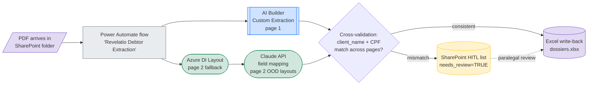
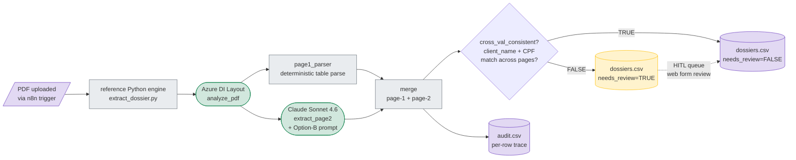
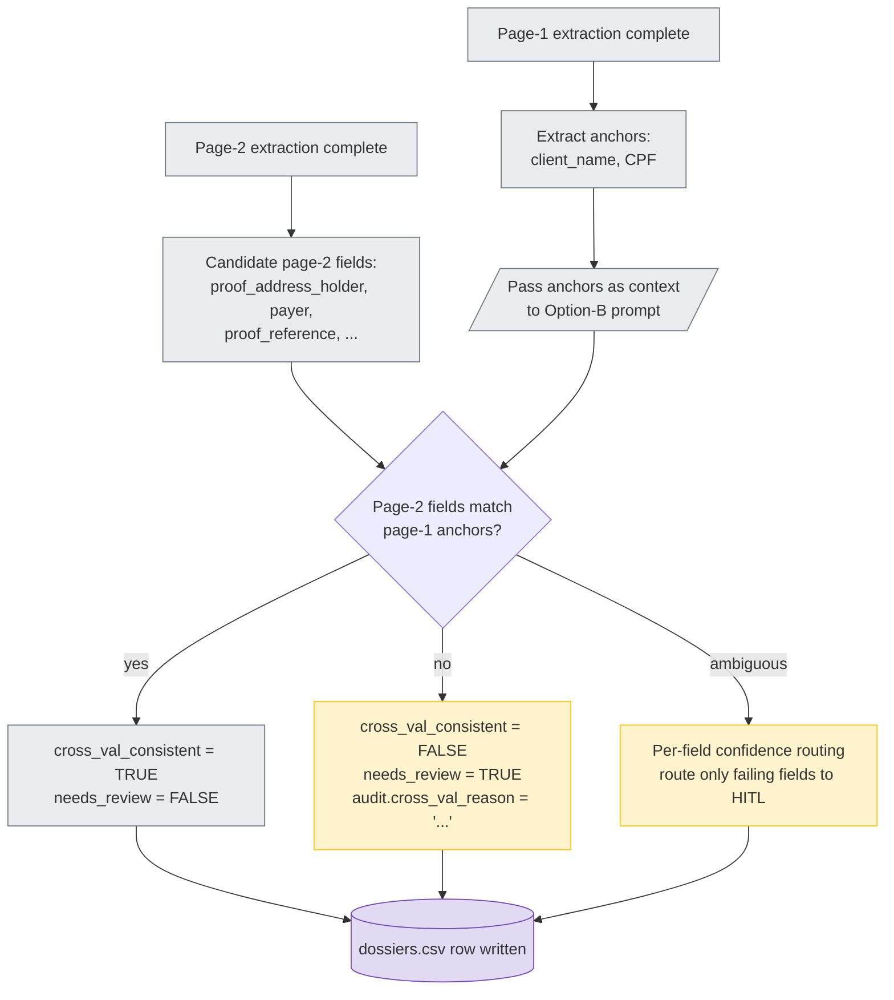
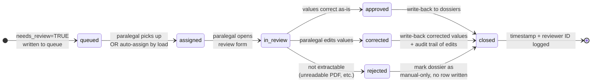

# Project Revelatio — Architecture Diagrams

> **Status**: Epic 7 deliverable (1 of 3). Written 2026-05-11. Internal language: EN. PT-BR translation lives in the relatório (Epic 8).

The recommended Project Revelatio architecture is **hybrid and routing-based**, not a single tool. This document is the visual contract for that architecture: every box in every diagram maps to a tool that was empirically evaluated in Epic 5, and every arrow corresponds to a decision rule we can defend from the artifacts in `04_experiments/` and `06_reference_script/`.

---

## 0. How to read these diagrams

**Shape convention**:

| Shape | Means |
|---|---|
| `[Rectangle]` | Workflow step (Power Automate action, n8n node, script function) |
| `{Diamond}` | Decision / gate |
| `([Stadium])` | LLM call (Claude, GPT) |
| `[(Cylinder)]` | Storage (SharePoint, CSV, database) |
| `[/Parallelogram/]` | Input/output (file, row) |

**Color convention** (CSS classes applied at the bottom of each diagram):

| Class | Means |
|---|---|
| `trained` (blue fill) | Model trained on labeled data (AI Builder Custom Extraction, Azure DI Custom Neural) |
| `prebuilt` (green fill) | Prebuilt commercial service (Azure DI Layout, Anthropic API) |
| `script` (gray fill) | Deterministic code (page-1 parser, normalizers) |
| `hitl` (amber fill) | Human-in-the-loop step |
| `store` (purple fill) | Persistent storage |

**Arrow convention**: solid = data flow; dashed = control / feedback / write-back.

---

## 1. Diagram 1 — M365 path (primary recommendation)

**When this applies**: firm already has Microsoft 365 licenses and prefers a no-code maintainable workflow. This is the path recommended in `decisions.md` ADR D-005 for M365-resident firms with access to ≥5 real Banco X dossiers for AI Builder training.

**Anchors for Diagram 1**:

| Box / arrow | Empirical anchor |
|---|---|
| AI Builder Custom Extraction (page 1) | 100% page-1 visual on synthetic corpus (SCOREBOARD §1 row 1); 92.8% dossier-level synthetic avg with 0 hallucinations (`04_experiments/02_power_automate/scorecard.json`) |
| Azure DI Layout (page 2 fallback) | Page-2 paragraph detection on brief PDF (`04_experiments/06_azure_di/notes.md`); layout-tolerant where AI Builder template-matching fails (SCOREBOARD §1 footnote 1) |
| Claude API page-2 field mapping | 100% on brief PDF (`04_experiments/04_claude/output_scorecard.json`); same Option-B prompt validated in `06_reference_script/claude_extractor.py` |
| Cross-validation gate | Motivation: Epic 5.2 finding #5 (single-field gating insufficient — CPF 0.99 routed garbage page-2). Implementation in PA is a Compose action comparing AI Builder + DI/Claude `client_name`/`CPF` |
| SharePoint HITL list | Design only — not built in PoC. Reviewer-friendly, audit-able rationale per SCOREBOARD §3 last row |
| Excel write-back | Validated end-to-end in Epic 5.2 (`04_experiments/02_power_automate/raw_output/debtor_extraction.xlsx`) |

**Why the Claude API box is on the M365 path** (not just on non-M365): AI Builder's page-2 catastrophic failure on the brief PDF (4 fields emitted footer / pagination text, see `04_experiments/02_power_automate/notes.md` Phase 1.5) is the production-blocking failure mode that justifies an LLM fallback on out-of-distribution layouts. The flow can route only page-2-low-confidence dossiers to the LLM, keeping per-dossier cost near zero for the happy path.

---

## 2. Diagram 2 — Non-M365 path (alternative recommendation)

**When this applies**: firm has no M365 commitment, prefers OSS / vendor-neutral stack, or already has Python / Linux infrastructure. This is the architecture implemented as a reference in `06_reference_script/` and empirically validated at 99.07% / 0 hallucinations / $0.00886/dossier on a 3-PDF test corpus.

**Anchors for Diagram 2**:

| Box / arrow | Empirical anchor |
|---|---|
| n8n trigger | Dossier `02_tool_universe/05_n8n.md`; not hands-on-built in this PoC (engine is the validated artifact) |
| Reference Python engine | `06_reference_script/extract_dossier.py` (130 lines, CLI orchestrator) |
| Azure DI Layout `analyze_pdf` | `06_reference_script/azure_di_client.py` (31 lines); $0.003/dossier (2 pages @ $1.50/1000 per Microsoft pricing) |
| `page1_parser` | `06_reference_script/page1_parser.py` (79 lines); normalizes BR dates DD/MM/YYYY → YYYY-MM-DD, money "R$ 18.450,00" → "18450.00", "147 dias" → 147 |
| Claude Sonnet 4.6 + Option-B prompt | `06_reference_script/claude_extractor.py` (95 lines); $0.0033 input + $0.0057 output per dossier |
| `dossiers.csv` + `audit.csv` | `06_reference_script/test_corpus/dossiers.csv` + `audit.csv` (3-PDF validation run) |
| 99.07% avg / 0 hallucinations / $0.00886 | `06_reference_script/notes.md` lines 33–38 (results table) |

The reference script is the **only tested configuration** that simultaneously: (a) handles page-2 layout drift like the LLMs, (b) operates at API scale unlike the chat UIs, (c) provides full audit trail and cross-validation unlike a plain LLM call, (d) costs less than 100 USD for the full backlog (`notes.md` line 63–65).

---

## 3. Diagram 3 — Cross-validation flow (Option-B)

**Why this exists**: Epic 5.2 finding #5 — a single high-confidence anchor (CPF 0.99) is insufficient. The example PDF was routed to "Verdadeiro" because CPF matched, even though 4 page-2 fields were garbage (footer text + pagination marker). Cross-validation gates page-2 acceptance on **per-page consistency between page-1 anchors and page-2 candidates**, mirroring the Option-B prompt design implemented in `06_reference_script/claude_extractor.py`.

**Anchors for Diagram 3**:

| Box / arrow | Empirical anchor |
|---|---|
| Motivation (single-field gating insufficient) | `04_experiments/02_power_automate/notes.md` Phase 1.5 — 4 page-2 fields catastrophically wrong on brief PDF despite CPF 0.99 |
| Page-1 anchor selection (`client_name`, CPF) | `06_reference_script/claude_extractor.py` Option-B prompt block (passes anchors as context to LLM) |
| `cross_val_consistent` column | `06_reference_script/test_corpus/audit.csv` schema |
| `needs_review` column | `06_reference_script/test_corpus/dossiers.csv` schema; corresponds to `dossier.needs_review=TRUE` rows |
| Per-field confidence routing (vs. per-dossier) | Design extension from PA finding #5 — production should route only failing fields, not the whole dossier |

**Behavior on the brief PDF**: with Option-B, the brief PDF page-2 garbage (footer text in `proof_reference`) **would** fail the cross-validation check (footer text does not match `client_name` or CPF anchor pattern) and route to HITL — preventing the exact production-blocking failure that the single-field gate allowed through.

---

## 4. Diagram 4 — HITL queue lifecycle

The HITL queue is the safety net that converts the system's quantitative confidence (cross-validation, per-field probabilities) into bounded human review. Both architecture paths (M365 and non-M365) share the same lifecycle; only the **storage substrate** differs (SharePoint list vs. database table).

**Storage variants** (same lifecycle, two implementations):

| Variant | Queue store | Review UI | Audit |
|---|---|---|---|
| M365 path | SharePoint list "Revelatio HITL" | SharePoint native form | SharePoint version history + Power Automate run history |
| Non-M365 path | DB table (any relational store) | Flask / Streamlit form (production replacement for `06_reference_script/app.py`) | DB audit table + `audit.csv` append-only log |

**Anchors for Diagram 4**:

| Box / state | Empirical anchor |
|---|---|
| `needs_review=TRUE` trigger | `06_reference_script/test_corpus/dossiers.csv` column |
| Cross-validation gate writing to queue | `06_reference_script/notes.md` lines 25–27 |
| Reviewer-friendly + audit-able rationale | SCOREBOARD §3 last row |
| LGPD implications (paralegal RBAC, queue access control) | Cross-reference `07_architecture/lgpd.md` §5 |

---

## 5. Decision rubric — which path for which firm

| Has M365 licenses? | Has dev capacity? | Has ≥30 real Banco X dossiers? | Recommended path | Page-2 strategy |
|---|---|---|---|---|
| ✅ | ❌ | ✅ | **M365 path** | AI Builder Custom Extraction (retrained on real dossiers) + Azure DI Layout fallback |
| ✅ | ❌ | ❌ | **M365 path** | Azure DI Layout + Claude API fallback only (skip AI Builder retraining until data available) |
| ✅ | ✅ | ✅ | **M365 path or hybrid** | M365 for happy path + reference Python engine for high-confidence batch reprocessing |
| ✅ | ✅ | ❌ | **M365 path** | Same as M365/no-dev/no-data row above; dev capacity unlocks Custom Neural training later |
| ❌ | ✅ | ✅ | **Non-M365 path** | Reference Python engine + train Azure DI Custom Neural on the real dossiers |
| ❌ | ✅ | ❌ | **Non-M365 path** | Reference Python engine as-is; collect dossiers from production run for future training |
| ❌ | ❌ | — | Outsource / not viable in-house | — |

**Anchors for §5**: SCOREBOARD §3 "Role in the recommended architecture" table; ADR D-004 (M365 priority) + D-005 (Power Automate primary) in `decisions.md`.

The rubric is intentionally pessimistic about "no M365 + no dev capacity" — there is no honest version of this stack that a non-technical firm can operate alone. The relatório should be explicit that the firm needs at least one of {M365 ops capacity, Python dev capacity, or an external implementation partner}.

---

## 6. Anchors index (all diagrams)

| Claim or component | File | Note |
|---|---|---|
| Architecture is hybrid, not single-tool | `04_experiments/SCOREBOARD.md` §3 + §6 | Source-of-truth for relatório §4 |
| M365 path 92.8% synthetic / 0 hallucinations | `04_experiments/02_power_automate/scorecard.json` | n=4 synthetic PDFs (F01, F02, F05, F06) |
| Page-2 OOD failure on brief PDF | `04_experiments/02_power_automate/notes.md` Phase 1.5 | 4 specific cells emitted footer / pagination |
| Azure DI Layout page-2 paragraph detection | `04_experiments/06_azure_di/notes.md` | Component validation only — not end-to-end scored |
| Non-M365 path 99.07% / 0 hallucinations / $0.00886 | `06_reference_script/notes.md` lines 33–38 | n=3 PDFs (brief + F02 + F07) |
| Option-B cross-validation prompt | `06_reference_script/claude_extractor.py` | 95-line implementation |
| `dossiers.csv` / `audit.csv` schemas | `06_reference_script/test_corpus/` | Live output from validation run |
| Single-field-gating-insufficient (motivation for cross-val) | `04_experiments/02_power_automate/notes.md` finding #5 | Epic 5.2 |
| Strategic locks (M365 primary, n8n alternative) | `decisions.md` ADRs D-004, D-005 | Frozen before Epic 7 |

---

## 7. What this document does NOT cover

- **Implementation code**: see `06_reference_script/` for the working non-M365 engine; M365 path is documented step-by-step in `04_experiments/02_power_automate/notes.md`.
- **ROI math**: see `07_architecture/roi.md`.
- **LGPD posture**: see `07_architecture/lgpd.md`.
- **Methodology caveats** (n=1 brief PDF, synthetic-vs-real-layout drift): see SCOREBOARD §5; relatório §3 will own these honestly.
