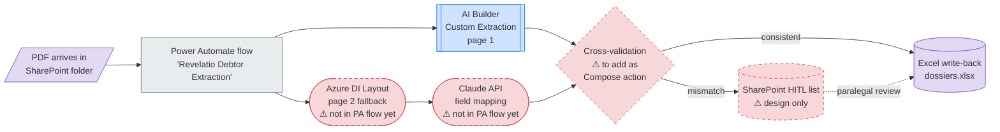
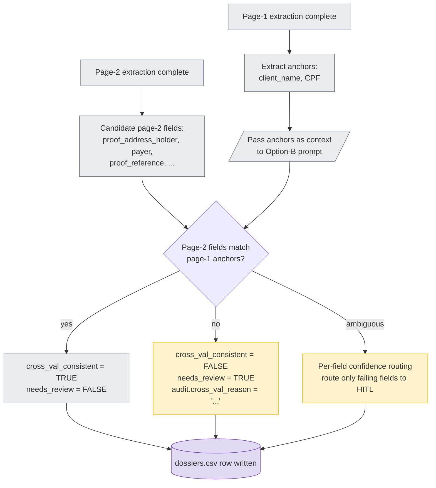
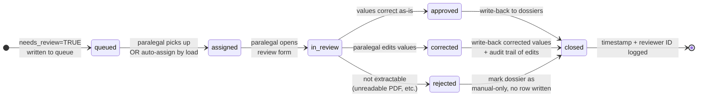

# Project Revelatio — Architecture Diagrams

> **Status**: Epic 7 deliverable (1 of 3). Written 2026-05-11. Internal language: EN. PT-BR translation lives in the relatório (Epic 8).

The recommended Project Revelatio architecture is **hybrid and routing-based**, not a single tool. This document is the visual contract for that architecture: every box in every diagram maps to a tool that was empirically evaluated in Epic 5, and every arrow corresponds to a decision rule we can defend from the artifacts in `04_experiments/` and `06_reference_script/`.

---

## 0. How to read these diagrams

**Shape convention**:

| Shape | Means |
|---|---|
| `[Rectangle]` | Workflow step (Power Automate action, n8n node, script function) |
| `{Diamond}` | Decision / gate |
| `([Stadium])` | LLM call (Claude, GPT) |
| `[(Cylinder)]` | Storage (SharePoint, CSV, database) |
| `[/Parallelogram/]` | Input/output (file, row) |

**Color convention** (CSS classes applied at the bottom of each diagram):

| Class | Means |
|---|---|
| `trained` (blue fill) | Model trained on labeled data (AI Builder Custom Extraction, Azure DI Custom Neural) |
| `prebuilt` (green fill) | Prebuilt commercial service (Azure DI Layout, Anthropic API) |
| `script` (gray fill) | Deterministic code (page-1 parser, normalizers) |
| `hitl` (amber fill) | Human-in-the-loop step |
| `store` (purple fill) | Persistent storage |
| `unbuilt` (pink fill, red dashed border) | Specified architecturally but **not built inside the PoC**; must be added before production. Introduced 2026-05-12 to honor the D-006 honesty around what was actually implemented. |

**Arrow convention**: solid = data flow; dashed = control / feedback / write-back.

---

## 1. Diagram 1 — M365 path (alternative recommendation for M365-resident firms; reclassified by D-006 on 2026-05-12)

**When this applies**: firm already has Microsoft 365 licenses **and** prefers no-code maintenance by paralegal **and** has access to ≥5 real Banco X dossiers for AI Builder training. Reclassified to alternative path by D-006 (2026-05-12): the page-1 layer (AI Builder) is built end-to-end in Epic 5.2, but the page-2 fallback (Azure DI Layout + Claude API for out-of-distribution layouts) is specified architecturally yet not added inside the PA flow in the PoC — for production this branch must be added as an HTTP connector inside Power Automate. The primary recommended path (Diagram 2, built and validated end-to-end) avoids this gap.



**Legend for this diagram**: green = prebuilt service that exists in Azure / Anthropic; blue = trained model that exists in the AI Builder portal; gray = workflow logic actually built in Power Automate; purple = storage; **pink with red dashed border = component referenced in the architecture but NOT wired into the PA flow in this PoC**. The pink-dashed pieces (D, E, F, H) are the gap between what we built in Epic 5.2 (page-1 happy path) and what production needs (page-2 fallback + cross-validation + HITL list). All four are achievable with PA's native HTTP connector + Compose action + SharePoint list — they were left unbuilt in the PoC because the validated end-to-end pipeline lives in `06_reference_script/` (Diagram 2).

**Anchors for Diagram 1** (✅ = built in PoC; ⚠ = specified, not built):

| Box / arrow | Status | Empirical anchor |
|---|---|---|
| Power Automate flow (B) | ✅ built (Epic 5.2) | End-to-end flow file in tenant; run history in Power Automate portal |
| AI Builder Custom Extraction page 1 (C) | ✅ built (Epic 5.2) | 100% page-1 visual on synthetic corpus (SCOREBOARD §1 row 1); 92.8% dossier-level synthetic avg with 0 hallucinations (`04_experiments/02_power_automate/scorecard.json`) |
| Azure DI Layout page 2 fallback (D) | ⚠ specified, not in PA flow | Azure DI resource exists and is validated as a component (`04_experiments/06_azure_di/notes.md`) but no PA HTTP connector wired to it yet; the validated end-to-end usage lives in `06_reference_script/azure_di_client.py` |
| Claude API page-2 field mapping (E) | ⚠ specified, not in PA flow | Same Option-B prompt validated in `06_reference_script/claude_extractor.py` (100% on brief + F02 + F07 + F09 OOD); no PA HTTP connector calling Anthropic yet |
| Cross-validation gate (F) | ⚠ specified, not in PA flow | Motivation: Epic 5.2 finding #5. Implementation in PA would be a Compose action comparing AI Builder + DI/Claude `client_name`/`CPF`. Currently implemented in Python only (`06_reference_script/claude_extractor.py` Option-B prompt) |
| SharePoint HITL list (H) | ⚠ design only | Reviewer-friendly, audit-able rationale per SCOREBOARD §3 last row; SharePoint list not provisioned in PoC tenant |
| Excel write-back (G) | ✅ built (Epic 5.2) | `04_experiments/02_power_automate/raw_output/debtor_extraction.xlsx` |

**Why the Claude API box is on the M365 path** (not just on non-M365): AI Builder's page-2 catastrophic failure on the brief PDF (4 fields emitted footer / pagination text, see `04_experiments/02_power_automate/notes.md` Phase 1.5) is the production-blocking failure mode that justifies an LLM fallback on out-of-distribution layouts. The flow can route only page-2-low-confidence dossiers to the LLM, keeping per-dossier cost near zero for the happy path.

---

## 2. Diagram 2 — Non-M365 path with reference Python engine (primary recommendation as of D-006, 2026-05-12)

**When this applies**: firm has no M365 commitment, prefers OSS / vendor-neutral stack, or already has Python / Linux infrastructure. **As of D-006 (2026-05-12), this is also the *primary* recommended path** across all firm profiles in the rubric below — Diagram 1 (M365 path) remains a valid alternative for M365-resident firms preferring no-code maintenance. This non-M365 architecture is implemented in `06_reference_script/` and empirically validated at **100% / 0 hallucinations / $0.00934/dossier** on a 3-PDF baseline plus an OOD holdout (`F09_brief_shape.pdf`, brief-faithful structure with fresh client data). **As of D-007 (2026-05-12), the engine is also exposed publicly at `https://revelatio-demo.streamlit.app`** via a Streamlit Community Cloud deployment that wraps `extract_dossier.process_one()` and writes results to a shared Google Sheet.

```mermaid
flowchart LR
    A[/PDF arrives via<br/>Streamlit Cloud upload<br/>or CLI for batch/] --> B[reference Python engine<br/>extract_dossier.py]
    B --> C([Azure DI Layout<br/>analyze_pdf])
    C --> D[page1_parser<br/>deterministic table parse]
    C --> E([Claude Sonnet 4.6<br/>extract_page2<br/>+ Option-B prompt])
    D --> F[merge<br/>page-1 + page-2]
    E --> F
    F --> G{cross_val_consistent?<br/>page-2 Titular/Pagador<br/>match page-1 client_name?}
    G -- TRUE --> H[(dossiers.csv<br/>needs_review=FALSE)]
    G -- FALSE --> I[(dossiers.csv<br/>needs_review=TRUE)]
    F --> J[(audit.csv<br/>per-row trace)]
    H --> K[(Google Sheet<br/>append_dossiers<br/>shared with panel)]
    I -.HITL queue<br/>⚠ production review form unbuilt<br/>Streamlit app.py is demo skin.-> H

    classDef prebuilt fill:#d1e7dd,stroke:#198754
    classDef script fill:#e9ecef,stroke:#6c757d
    classDef hitl fill:#fff3cd,stroke:#ffc107
    classDef store fill:#e2d9f3,stroke:#6f42c1
    classDef unbuilt fill:#f8d7da,stroke:#dc3545,stroke-dasharray: 5 5
    class C,E prebuilt
    class A,B,D,F script
    class I hitl
    class H,J,K store
```

**Legend for this diagram**: every gray (script) and green (prebuilt) box was **built and exercised end-to-end** — the empirical 100% / 0 hallucinations / $0.00934 result comes from running this exact graph on the 3-PDF baseline + the OOD holdout. Box A is no longer pink-dashed: as of D-007 the public Streamlit Cloud deployment (`06_reference_script/app.py` served at `https://revelatio-demo.streamlit.app`) is the validated entry point for interactive use; the CLI in `extract_dossier.py --batch` is the alternate entry point for headless batch runs. **The single remaining pink-dashed item** is the production HITL review form for `needs_review=TRUE` rows — the Streamlit UI surfaces the flag but does not implement the per-field review workflow with SSO described in `06_reference_script/notes.md` production hardening item #6. Box K (Google Sheet sink) is the demo write-back target shared with the hiring panel; in production it would be replaced by the firm's chosen spreadsheet/database destination.

**Anchors for Diagram 2** (✅ = built and validated in PoC; ⚠ = recommended for production, not built):

| Box / arrow | Status | Empirical anchor |
|---|---|---|
| PDF arrival (A) | ✅ public Streamlit Cloud deploy + CLI for batch | Streamlit Cloud app at `https://revelatio-demo.streamlit.app` (source: `06_reference_script/app.py`, Epic 8.5 / D-007); CLI alternate at `extract_dossier.py --batch input_dir/ --out output_dir/` — both call the same `process_one()` engine. n8n remains a recommended production batch orchestrator (`02_tool_universe/05_n8n.md`) but is unbuilt in PoC |
| Google Sheet sink (K) | ✅ built (Epic 8.5) | `06_reference_script/sheets_writer.py` (gspread + service-account auth, append-only with `extracted_at` UTC stamp); demo sheet shared with the hiring panel |
| Reference Python engine (B) | ✅ built | `06_reference_script/extract_dossier.py` (130 lines, CLI orchestrator) |
| Azure DI Layout `analyze_pdf` (C) | ✅ built | `06_reference_script/azure_di_client.py` (31 lines); $0.003/dossier (2 pages @ $1.50/1000 per Microsoft pricing) |
| `page1_parser` (D) | ✅ built | `06_reference_script/page1_parser.py` (79 lines); normalizes BR dates DD/MM/YYYY → YYYY-MM-DD, money "R$ 18.450,00" → "18450.00", "147 dias" → 147 |
| Claude Sonnet 4.6 + Option-B prompt (E) | ✅ built | `06_reference_script/claude_extractor.py` (~100 lines, post-2026-05-12 literal-extraction rule); ~$0.00362 input + ~$0.00572 output per dossier |
| Cross-validation gate (G) | ✅ built | Option-B prompt implements the gate; `cross_val_consistent` column in `06_reference_script/test_corpus/audit.csv` |
| `dossiers.csv` + `audit.csv` (H, I, J) | ✅ built | `06_reference_script/test_corpus/dossiers.csv` + `audit.csv` (baseline 3-PDF re-run); F09 OOD outputs reproducible via `extract_dossier.py 05_synthetic_data/pdfs/F09_brief_shape.pdf` |
| HITL review form (I → H dashed arrow) | ⚠ production per-field form unbuilt | The deployed Streamlit app (`06_reference_script/app.py` at `https://revelatio-demo.streamlit.app`) surfaces `needs_review=TRUE` rows but does not implement the per-field review workflow with SSO; that replacement is hardening item #6 in `06_reference_script/notes.md` |
| 100% avg / 0 hallucinations / $0.00934 (3-PDF baseline + OOD holdout F09) | ✅ empirically measured | `06_reference_script/notes.md` results table + OOD validation section |

The reference script is the **only tested configuration** that simultaneously: (a) handles page-2 layout drift like the LLMs, (b) operates at API scale unlike the chat UIs, (c) provides full audit trail and cross-validation unlike a plain LLM call, (d) costs less than 100 USD for the full backlog (`notes.md` line 63–65).

---

## 3. Diagram 3 — Cross-validation flow (Option-B)

**Why this exists**: Epic 5.2 finding #5 — a single high-confidence anchor (CPF 0.99) is insufficient. The example PDF was routed to "Verdadeiro" because CPF matched, even though 4 page-2 fields were garbage (footer text + pagination marker). Cross-validation gates page-2 acceptance on **per-page consistency between page-1 anchors and page-2 candidates**, mirroring the Option-B prompt design implemented in `06_reference_script/claude_extractor.py`.



**Anchors for Diagram 3**:

| Box / arrow | Empirical anchor |
|---|---|
| Motivation (single-field gating insufficient) | `04_experiments/02_power_automate/notes.md` Phase 1.5 — 4 page-2 fields catastrophically wrong on brief PDF despite CPF 0.99 |
| Page-1 anchor selection (`client_name`, CPF) | `06_reference_script/claude_extractor.py` Option-B prompt block (passes anchors as context to LLM) |
| `cross_val_consistent` column | `06_reference_script/test_corpus/audit.csv` schema |
| `needs_review` column | `06_reference_script/test_corpus/dossiers.csv` schema; corresponds to `dossier.needs_review=TRUE` rows |
| Per-field confidence routing (vs. per-dossier) | Design extension from PA finding #5 — production should route only failing fields, not the whole dossier |

**Behavior on the brief PDF**: with Option-B, the brief PDF page-2 garbage (footer text in `proof_reference`) **would** fail the cross-validation check (footer text does not match `client_name` or CPF anchor pattern) and route to HITL — preventing the exact production-blocking failure that the single-field gate allowed through.

---

## 4. Diagram 4 — HITL queue lifecycle

The HITL queue is the safety net that converts the system's quantitative confidence (cross-validation, per-field probabilities) into bounded human review. Both architecture paths (M365 and non-M365) share the same lifecycle; only the **storage substrate** differs (SharePoint list vs. database table).



**Storage variants** (same lifecycle, two implementations):

| Variant | Queue store | Review UI | Audit |
|---|---|---|---|
| M365 path | SharePoint list "Revelatio HITL" | SharePoint native form | SharePoint version history + Power Automate run history |
| Non-M365 path | DB table (any relational store) | Flask / Streamlit form (production replacement for `06_reference_script/app.py`) | DB audit table + `audit.csv` append-only log |

**Anchors for Diagram 4**:

| Box / state | Empirical anchor |
|---|---|
| `needs_review=TRUE` trigger | `06_reference_script/test_corpus/dossiers.csv` column |
| Cross-validation gate writing to queue | `06_reference_script/notes.md` lines 25–27 |
| Reviewer-friendly + audit-able rationale | SCOREBOARD §3 last row |
| LGPD implications (paralegal RBAC, queue access control) | Cross-reference `07_architecture/lgpd.md` §5 |

---

## 5. Decision rubric — which path for which firm

Default after D-006 (2026-05-12): **the reference Python engine (Diagram 2) is the recommended starting point**, because it is the artifact we built end-to-end and validated empirically. The M365 path (Diagram 1) is opted into when the firm is M365-resident *and* values no-code maintenance over having a turnkey engine — at the cost of building the page-2 fallback inside PA before production.

| Has Microsoft 365 licenses? | Has dev / DevOps capacity? | Has ≥30 real Banco X dossiers? | Recommended path | Page-2 strategy |
|---|---|---|---|---|
| ❌ | ✅ | ✅ | **Primary path (Diagram 2)** | Ref Python engine as-is + later train Azure DI Custom Neural on the real dossiers |
| ❌ | ✅ | ❌ | **Primary path (Diagram 2)** | Ref Python engine as-is; collect dossiers from the first production batch for future Custom Neural training |
| ✅ | ✅ | any | **Primary path (Diagram 2) — M365 path (Diagram 1) as opt-in fallback** | Ref engine for the happy path; M365 alternative available if the firm hard-requires no-code paralegal maintenance |
| ✅ | ❌ | ✅ | **Alternative path (Diagram 1)** | AI Builder (retrained on real dossiers) for page 1 + Azure DI Layout / Claude API fallback for page 2 — **must be wired into the PA flow before production** (currently unbuilt) |
| ✅ | ❌ | ❌ | **Alternative path (Diagram 1)** | Azure DI Layout + Claude API fallback only (skip AI Builder retraining until data available) — same PA-flow build-out required |
| ❌ | ❌ | — | Outsource / not viable in-house | — |

**Anchors for §5**: SCOREBOARD §3 "Role in the recommended architecture" table; ADRs D-004 (M365 priority during evaluation), D-005 (Power Automate primary, pre-2026-05-12), and **D-006 (Python engine primary, 2026-05-12)** in `decisions.md`.

The rubric is intentionally pessimistic about "no M365 + no dev capacity" — there is no honest version of this stack that a non-technical firm can operate alone. The relatório should be explicit that the firm needs at least one of {M365 ops capacity, Python dev capacity, or an external implementation partner}.

---

## 6. Anchors index (all diagrams)

| Claim or component | File | Note |
|---|---|---|
| Architecture is hybrid, not single-tool | `04_experiments/SCOREBOARD.md` §3 + §6 | Source-of-truth for relatório §4 |
| M365 path 92.8% synthetic / 0 hallucinations | `04_experiments/02_power_automate/scorecard.json` | n=4 synthetic PDFs (F01, F02, F05, F06) |
| Page-2 OOD failure on brief PDF | `04_experiments/02_power_automate/notes.md` Phase 1.5 | 4 specific cells emitted footer / pagination |
| Azure DI Layout page-2 paragraph detection | `04_experiments/06_azure_di/notes.md` | Component validation only — not end-to-end scored |
| Non-M365 path (primary, D-006) 100% / 0 hallucinations / $0.00934 | `06_reference_script/notes.md` results table + OOD section | n=4 PDFs (brief + F02 + F07 baseline + F09_brief_shape OOD holdout) |
| Option-B cross-validation prompt | `06_reference_script/claude_extractor.py` | 95-line implementation |
| `dossiers.csv` / `audit.csv` schemas | `06_reference_script/test_corpus/` | Live output from validation run |
| Single-field-gating-insufficient (motivation for cross-val) | `04_experiments/02_power_automate/notes.md` finding #5 | Epic 5.2 |
| Strategic locks (current ordering: Python engine primary, M365 alternative) | `decisions.md` ADRs D-004, D-005, **D-006 (2026-05-12 supersedes D-005's primary/alternative ordering)**, **D-007 (2026-05-12 public Streamlit Cloud deploy + Google Sheets write-back)** | D-005 stays in the log as historical record |
| Public demo URL + Google Sheets write-back | `https://revelatio-demo.streamlit.app` + service-account-shared Google Sheet | D-007 (2026-05-12). Source: `06_reference_script/app.py` + `sheets_writer.py` + `labels_pt.py`. Deploy runbook at `DEPLOY.md` |
| OOD holdout `F09_brief_shape` (brief-faithful layout, fresh client data, 100% on the post-2026-05-12 prompt) | `05_synthetic_data/pdfs/F09_brief_shape.pdf` + `gold/F09_brief_shape.json` + generator at `05_synthetic_data/generate_brief_shaped_ood.py` | Reproducible via `extract_dossier.py 05_synthetic_data/pdfs/F09_brief_shape.pdf` |
| `unbuilt` class (pink dashed border in Diagrams 1 & 2) | §0 conventions table; introduced 2026-05-12 alongside D-006 | Marks components specified architecturally but not built in PoC |

---

## 7. What this document does NOT cover

- **Implementation code**: see `06_reference_script/` for the working non-M365 engine; M365 path is documented step-by-step in `04_experiments/02_power_automate/notes.md`.
- **ROI math**: see `07_architecture/roi.md`.
- **LGPD posture**: see `07_architecture/lgpd.md`.
- **Methodology caveats** (n=1 brief PDF, synthetic-vs-real-layout drift): see SCOREBOARD §5; relatório §3 will own these honestly.
